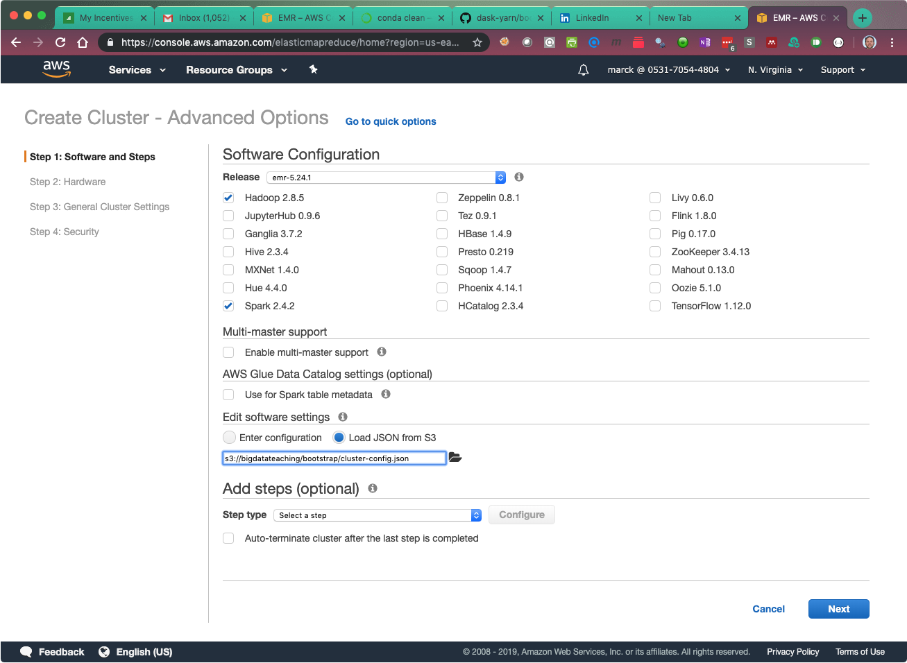
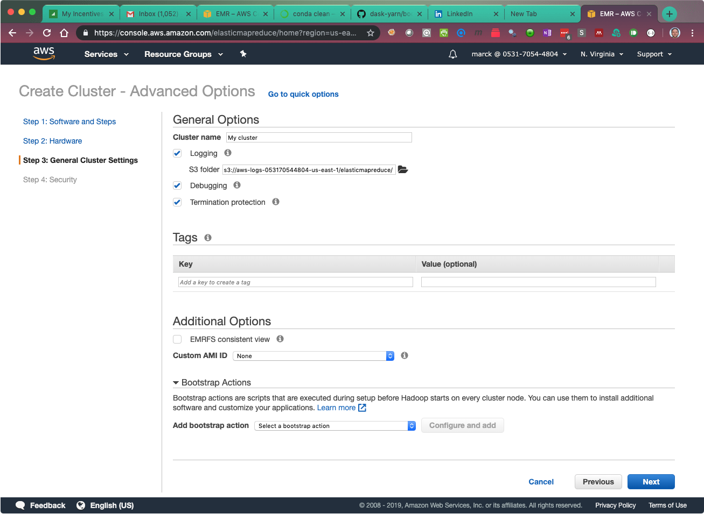
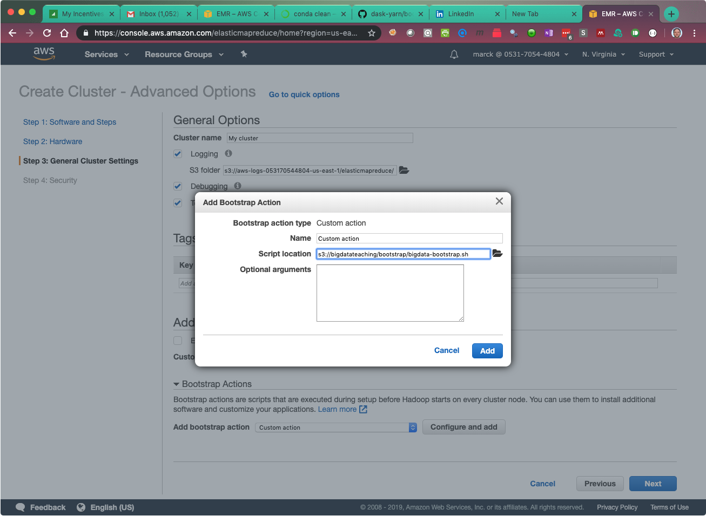
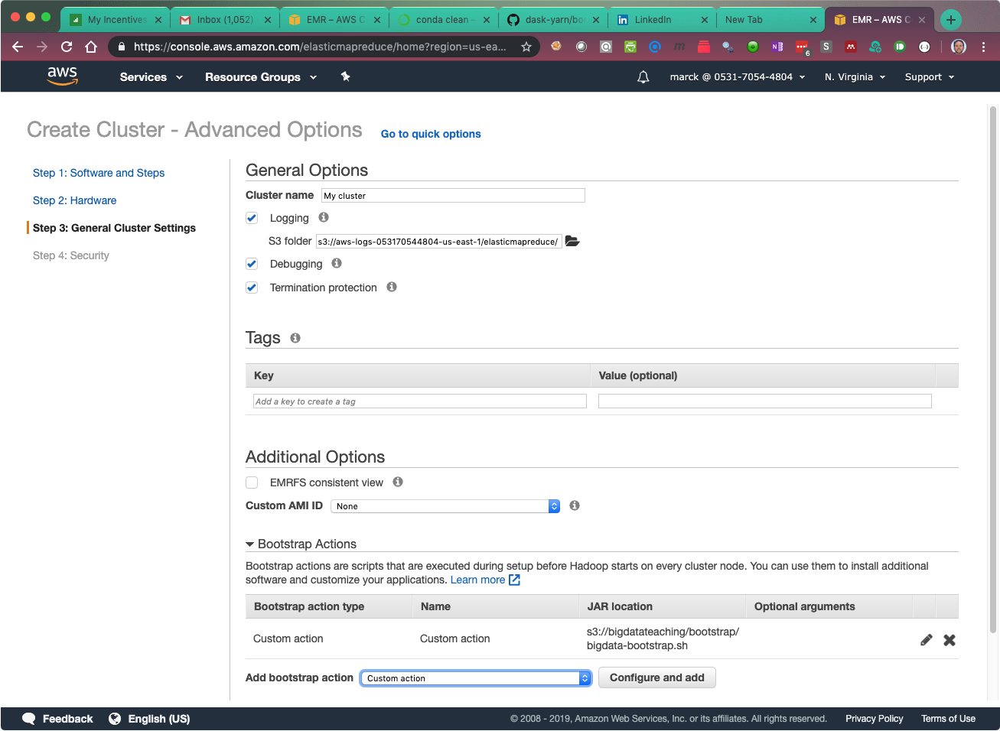

# Using Bootstrap actions and Software Customization for Spark

This guide will show you how to start a cluster using software customization and bootstrap actions. You should use this process going forward because it provide a more stable and consistent environment.

Here is a summary of what all of does:

* Installs Miniconda and Python3 on every node of the cluster, with many additional Python libraries
* Installs and starts [JupyterLab](https://blog.jupyter.org/jupyterlab-is-ready-for-users-5a6f039b8906) automatically on port 8765, and you can use it for many repositories
* Installs git
* Dowloands additional libraries needed for GraphX and GraphFrames
* Tells YARN to allocate the most possible resources to Spark

Both files are included here for reference.

## Cluster Setup

### Step 1: Software and Steps

* Click create cluster and go to  **_Advanced Options_**
* Select `emr-5.29.0` from the drop-down
* Make sure the **only these applications are selected**: 
	* Hadoop 2.8.5 
	* Spark 2.4.4
	* **Uncheck everything else**
* In the **_Edit software settings_** section, click on **_Load JSON from S3_**, and enter the following location in the box: `s3://bigdatateaching/bootstrap/cluster-config.json`



* Click Next

### Step 2: Hardware

* Chose the recommended cluster size for the task. 
* Use `m5.xlarge` or larger instance types
* Click Next

### Step 3: General Cluster Settings

* Give your cluster a name that is meaningful to you.
* Towards the bottom of the screen, click on the triangle next to **_Bootstrap Actions_** to expand the section:



* In the **_Add bootstrap action_** dropdown, select **_Custom action_**
 and click on **_Configure and add_**
 
 

* In the _Add Bootstrap Action_ dialog box, enter the following location in the _Script location_ section: `s3://bigdatateaching/bootstrap/bigdata-bootstrap.sh`

 

* Make sure you see the action added in the screen before you click next

 

* Click Next

### Step 4. Security

* Select your key-pair
* Click **_Create cluster_**

## Connect to the cluster

**The startup time of the cluster in this case will be longer than you have seen before. It should take about 10 minutes to have a cluster up and running and configured, but it can take longer.**

Once the cluster is in "Waiting" mode (should only take a few minutes), ssh into the master **with local port forwarding (-L)**, and with **agent forwarding (-A) if necessary**:

```
ssh-add
ssh -A -L 8765:localhost:8765 hadoop@...
```

You will see an updated login message:

``` 
EEEEEEEEEEEEEEEEEEEE MMMMMMMM           MMMMMMMM RRRRRRRRRRRRRRR
E::::::::::::::::::E M:::::::M         M:::::::M R::::::::::::::R
EE:::::EEEEEEEEE:::E M::::::::M       M::::::::M R:::::RRRRRR:::::R
  E::::E       EEEEE M:::::::::M     M:::::::::M RR::::R      R::::R
  E::::E             M::::::M:::M   M:::M::::::M   R:::R      R::::R
  E:::::EEEEEEEEEE   M:::::M M:::M M:::M M:::::M   R:::RRRRRR:::::R
  E::::::::::::::E   M:::::M  M:::M:::M  M:::::M   R:::::::::::RR
  E:::::EEEEEEEEEE   M:::::M   M:::::M   M:::::M   R:::RRRRRR::::R
  E::::E             M:::::M    M:::M    M:::::M   R:::R      R::::R
  E::::E       EEEEE M:::::M     MMM     M:::::M   R:::R      R::::R
EE:::::EEEEEEEE::::E M:::::M             M:::::M   R:::R      R::::R
E::::::::::::::::::E M:::::M             M:::::M RR::::R      R::::R
EEEEEEEEEEEEEEEEEEEE MMMMMMM             MMMMMMM RRRRRRR      RRRRRR

Your Big Data Cluster is Ready! You are logged into the master node.

Git is installed and Jupyter Lab is running in port 8765. You are
now able to clone multiple repositories and see them in a single
Jupyter session. There is not need to manually run a script.

To access Jupyter make sure you connect to the cluster with port
forwarding, and ssh-agent if necessary. If you did not, type exit
to log out and then log back in:

ssh -A -L8765:localhost:8765 hadoop@...
and then open a web browser on your laptop and go to
http://localhost:8765

Remember to configure your git settings (every time you create a
cluster. You only need to do this once.

git config --global user.name "[[your name]]"
git config --global user.email [[your email]]

Have fun!
--------------------------------------------------------------------
```

The one thing left for you to do is change the `git` configuration settings to your name and email.

You can then open a browser and navigate to [http://localhost:8765](http://localhost:8765) to see your Jupyter Lab environment.

